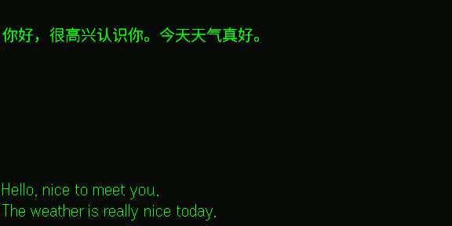
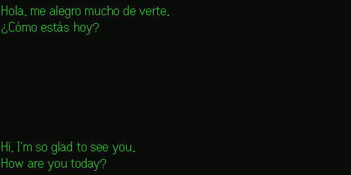
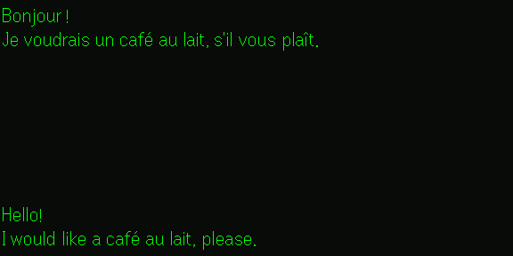

# Soniox Translate

**Real-time translation — with live captions — for the [Even Realities G2](https://www.evenrealities.com) smart glasses.**

Listen to someone speaking another language and the translation appears on your lens as they speak, with the original transcript right above it. Like subtitles for the real world.

> ## ⚡ Virtually real-time — not seconds behind
>
> Even Realities' built-in translation has a **noticeable lag**: the translated words land on your lens a second or two *after* they're spoken. **Soniox Translate streams every word the moment it's said**, so the translation keeps pace with the conversation instead of trailing it. Side by side, ours reads like live subtitles — the stock feature reads like a delayed replay.

Built for [Even Hub](https://hub.evenrealities.com), powered by [Soniox](https://soniox.com) real-time speech AI (60+ languages).

<p align="center">
  
  
</p>

> The glasses display is 576×288, 4-bit greyscale (bright green on a transparent, see-through lens). The original language sits up top, the translation below — the empty middle is the real world showing through.

## Features

- ⚡ **Real-time translation** to 24+ target languages (60+ supported by Soniox) — words appear as they're spoken, not a beat behind
- 🪟 **Translation-first split view** (original on top, translation below) or a clean **full-screen** translation
- 🎙️ **Live transcription** of the original language too, hands-free
- 🗣️ **Keep-as-is languages** — translate everything *except* the ones you choose
- 👥 Optional **speaker labels** (per-speaker icons) and **sentence-by-sentence** layout
- 🎚️ Tunable display — alignment, text width, line spacing, max lines, and a **bottom-anchored** caption flow that keeps the newest line in a fixed spot
- 📱 **Companion phone screen** for setup + a live transcript mirror
- 🔑 **Bring your own Soniox key** — your audio streams under *your* account, so you control usage and data
- 🔌 **Resilient connection** — auto-reconnect with backoff, backpressure handling, and serialized BLE calls

## How it works

```
G2 mic ─(PCM s16le 16kHz)─▶ WebView app ─▶ Soniox real-time WS (wss://stt-rt.soniox.com)
                                │                       │  transcript + translation tokens
                                ◀───────────────────────┘
                                ▼
              two text containers on the 576×288 lens (textContainerUpgrade)
              + a companion phone UI (settings + live mirror)
```

The app is a plain HTML + TypeScript page (Vite) that runs inside the Even companion app's WebView and talks to the glasses through the Even Hub SDK. Microphone audio (PCM s16le @ 16 kHz mono — the G2's native format) streams straight to Soniox's WebSocket API; the returned tokens are split into an original-language stream and a translated stream and rendered on the lens.

## Quick start

Requires Node 20+ and a free Soniox API key ([console.soniox.com](https://console.soniox.com)).

```bash
npm install
cp .env.example .env.local        # paste your Soniox key into VITE_STT_API_KEY (dev only)

npm run dev                       # Vite dev server at http://localhost:5173
npm run simulate                  # desktop G2 simulator (renders the 576×288 lens)
```

> `VITE_STT_API_KEY` is a **dev-only** convenience so the simulator works without typing a key. Production builds ignore it — every user enters their own key in the app's Settings, so they're billed for their own usage.

**On real glasses** (laptop + phone on the same Wi-Fi, no AP isolation):

```bash
npx @evenrealities/evenhub-cli qr --url "http://<your-lan-ip>:5173"
```

Scan the QR from the Even Realities app (Developer Mode → Scan); the app hot-loads on your G2.

**Validate Soniox alone** (no glasses needed — synthesizes speech with macOS `say`):

```bash
node scripts/soniox-smoke.mjs "hello from soniox"
SONIOX_TRANSLATE_TO=en SAY_VOICE="Mónica" node scripts/soniox-smoke.mjs "Hola, esto es una prueba."
```

## Settings (in the phone app)

Everything is configured in the companion Settings panel and persisted per-user via the SDK's storage. No env vars beyond the dev key.

| Setting | Default | Notes |
|---|---|---|
| Soniox API key | — | your own key; required to start |
| Translate to | English | target language (`None` = transcript only) |
| Don't translate | — | language codes to keep as-is, e.g. `es, fr` (target is always kept) |
| Show original transcript | on | off = translation full-screen |
| Alignment | Left | Left / Center (center via space-padding) |
| Anchor | Bottom | newest line pinned to the bottom (grows up) / Top |
| Line spacing | Normal | blank lines between sentences (Normal / Relaxed / Loose) |
| Text width | Full | Full / Wide / Medium / Narrow (centered column) |
| Max lines | Auto | cap the main pane to the last N lines |
| Split sentences | on | newline per sentence |
| Label speakers | off | per-speaker icons (`● ■ ★ …`) — best with 2+ speakers |

## Build & package for Even Hub

```bash
npm run build                                  # tsc + Vite production build → dist/
npx @evenrealities/evenhub-cli pack app.json dist -o soniox-translate.ehpk
```

Upload the `.ehpk` on [hub.evenrealities.com](https://hub.evenrealities.com). The production build ships **no API key** — verify with `grep <key> dist/` (should be empty).

## Screenshots

| Spanish → English | Chinese → English | French → English |
|---|---|---|
|  |  |  |

## Project layout

| Path | What |
|---|---|
| `src/asr/stt.ts` | Soniox real-time client (WS, translation, reconnect, backpressure) |
| `src/main.ts` | Glasses layout, text fitting/autoscroll, serial BLE queue, lifecycle |
| `src/ui.ts` | Companion phone UI (settings + live mirror) |
| `src/settings.ts`, `src/languages.ts` | Settings model / target-language list |
| `app.json` | Even Hub manifest (`g2-microphone` + `network` permissions) |
| `assets/` | App icon + store screenshots |

## Privacy

Microphone audio is captured only while the app is open and is sent to Soniox for transcription/translation. Your Soniox API key is stored only on your device.

## Credits

- [Even Realities](https://www.evenrealities.com) / [Even Hub](https://hub.evenrealities.com) — G2 glasses + SDK
- [Soniox](https://soniox.com) — real-time speech-to-text & translation
- Text measurement via [`@evenrealities/pretext`](https://www.npmjs.com/package/@evenrealities/pretext)

## License

[MIT](LICENSE) — not affiliated with or endorsed by Even Realities or Soniox.
